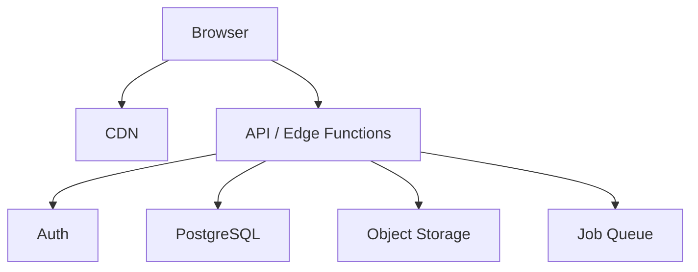
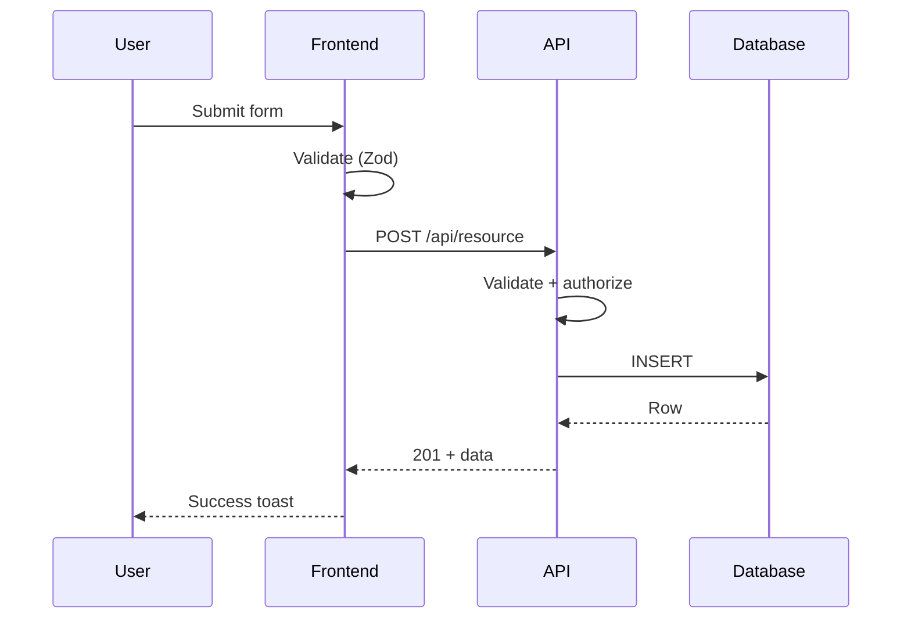
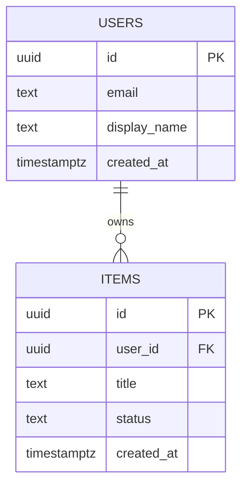

# Architecture Patterns Reference

Decision guide for selecting and implementing architecture patterns. Choose the simplest pattern that handles actual requirements, not aspirational ones.

---

## Pattern Selection

| Project Type | Start With | Upgrade When |
|---|---|---|
| Personal tool, <10 users | Monolith | Don't |
| Internal tool, single team | Monolith or BaaS-first | Team >3 or modules need independent deploy |
| SaaS MVP | BaaS-first (Supabase/Firebase) | Product-market fit confirmed |
| Data-heavy / event-driven | Serverless functions | Cold starts hurt user experience |
| Real-time collaborative | BaaS + WebSocket layer | Load exceeds single connection pool |

**Decision heuristic:** Count distinct types of work the system does.
- 1-3 → Monolith
- 4-8 with shared data → Modular monolith
- 8+ with independent data → Service boundaries (but probably still don't split)

---

## Pattern: Monolith

One process, one deploy. Use for: personal tools, internal tools, MVPs.

```
src/
├── app/           # Routes/pages
├── components/    # UI components
├── lib/           # Shared utilities (db, auth, api client)
├── hooks/         # Custom React hooks
├── types/         # TypeScript types
└── styles/        # Global styles
```

**Evolve when:** deploys >10 min, parts need different scaling, multiple teams collide.

---

## Pattern: Modular Monolith

One deploy, internal module boundaries. Each module owns its data and exports a clean interface.

```
src/
├── modules/
│   ├── auth/       # components/, api/, hooks/, types.ts
│   ├── billing/    # components/, api/, hooks/, types.ts
│   └── [feature]/
├── shared/         # Design system, utilities, shared types
└── app/            # Route wiring only
```

**Module rules:**
- Modules communicate through exported functions, never internal imports
- Each module owns its DB tables — no cross-module direct table access
- Shared state goes through a shared module or event bus
- Feature components stay in their module; only design-system components go in shared/

---

## Pattern: BaaS-First (Supabase / Firebase / Convex)

Backend-as-a-Service handles auth, database, storage, real-time. Build frontend against its API.

```
src/
├── app/
├── components/
├── lib/
│   ├── supabase.ts      # Client init
│   ├── queries/         # Read operations (one file per entity)
│   └── mutations/       # Write operations (one file per entity)
├── hooks/               # React hooks wrapping queries/mutations
└── types/
    └── database.ts      # Auto-generated from schema
```

**Key constraints:**
- RLS policies ARE your authorization layer — design them before writing frontend code
- Real-time subscriptions: use sparingly. Subscribe to specific rows, not entire tables.
- Auto-generated types: regenerate after every schema change (`supabase gen types`)
- Edge functions: use for anything the BaaS doesn't handle natively (webhooks, complex validation, third-party API calls)

---

## Pattern: Serverless / Edge Functions

Individual functions deployed independently. Use for: event-driven processing, webhook handlers, scheduled jobs.

```
functions/
├── api/
│   ├── users.ts
│   └── webhooks/stripe.ts
├── scheduled/
│   ├── daily-report.ts
│   └── cleanup.ts
└── shared/
    ├── db.ts
    └── auth.ts
```

**Constraints:**
- Stateless — no in-memory state between invocations
- Cold starts: 100-500ms. Acceptable for background jobs, problematic for UI-blocking calls.
- Vendor lock-in varies: Supabase Edge Functions (Deno), Vercel Functions (Node), AWS Lambda (Node/Python)
- Cost: pay-per-invocation. Cheap at low scale, unpredictable at high scale.

---

## Database Design Patterns

### Naming
- Tables: plural, snake_case (`user_profiles`, `order_items`)
- Columns: snake_case (`created_at`, `is_active`)
- Foreign keys: `[referenced_table_singular]_id` (`user_id`)
- Indexes: `idx_[table]_[columns]` (`idx_orders_user_id_created_at`)
- Enums: singular, snake_case values (`status: 'active' | 'archived' | 'deleted'`)

### Standard Columns
Every table gets these unless there's a reason not to:
```sql
id          uuid PRIMARY KEY DEFAULT gen_random_uuid(),
created_at  timestamptz NOT NULL DEFAULT now(),
updated_at  timestamptz NOT NULL DEFAULT now()
```

Add `created_by uuid REFERENCES auth.users(id)` and `updated_by` for audit-sensitive tables.

### Soft Deletes
Add `deleted_at timestamptz` instead of hard deleting. Filter with `WHERE deleted_at IS NULL`. Create a view for convenience:
```sql
CREATE VIEW active_items AS SELECT * FROM items WHERE deleted_at IS NULL;
```

### Multi-Tenancy
| Strategy | Isolation | Complexity | Use When |
|---|---|---|---|
| Row-level (`org_id` + RLS) | Low | Low | SaaS MVP, <100 tenants |
| Schema-level | Medium | Medium | Regulated industries |
| Database-level | High | High | Enterprise, contractual isolation |

Start with row-level. Upgrade only for regulatory/contractual reasons.

### JSON Columns
Use `jsonb` for truly variable/unstructured data (user preferences, metadata). If you query into the JSON frequently, promote those fields to real columns. Index with `CREATE INDEX idx_items_metadata ON items USING gin(metadata)`.

### Indexes
Create indexes for:
- Foreign keys (Postgres doesn't auto-index FK columns)
- Columns in WHERE clauses used by list/search queries
- Columns in ORDER BY for pagination queries
- Composite indexes for multi-column filters (put most selective column first)

Don't create indexes for: columns with low cardinality (boolean, enum with 3 values), tables with <1000 rows.

---

## API Design Patterns

### REST Conventions
| Operation | Method | Path | Success | Errors |
|---|---|---|---|---|
| List | GET | /api/v1/[resource] | 200 | 401, 403 |
| Get one | GET | /api/v1/[resource]/:id | 200 | 401, 403, 404 |
| Create | POST | /api/v1/[resource] | 201 | 400, 401, 403 |
| Update | PATCH | /api/v1/[resource]/:id | 200 | 400, 401, 403, 404 |
| Delete | DELETE | /api/v1/[resource]/:id | 204 | 401, 403, 404 |

### Error Response Shape
Standardize across all endpoints:
```json
{
  "error": {
    "code": "VALIDATION_ERROR",
    "message": "Email is required",
    "details": [{ "field": "email", "message": "Required" }]
  }
}
```

Machine-readable `code` for frontend logic. Human-readable `message` for display. `details` array for field-level validation.

### Pagination
**Offset-based** (simple, supports "jump to page"):
```
GET /api/v1/items?page=1&per_page=20
→ { data: [], meta: { page, per_page, total, total_pages } }
```

**Cursor-based** (better for real-time data, no duplicate/skip issues):
```
GET /api/v1/items?cursor=abc123&limit=20
→ { data: [], meta: { next_cursor, has_more } }
```

Use offset for admin tables. Use cursor for feeds, timelines, infinite scroll.

### API Versioning
- Version in URL path: `/api/v1/` (simple, explicit, recommended for most projects)
- When to version: breaking changes to request/response shape. Adding fields is NOT breaking.
- Keep at v1 until you actually need v2. Don't pre-version.

---

## Caching Strategy Patterns

| What to Cache | Where | TTL | Invalidation |
|---|---|---|---|
| API responses (GET) | TanStack Query (browser) | 5 min stale, refetch on focus | Mutation invalidates related queries |
| Static assets | CDN (Vercel/Cloudflare) | 1 year (hash in filename) | New deploy = new hash |
| Computed/aggregated data | Redis or DB materialized view | 1-60 min | Cron job or event trigger |
| Auth session | Cookie/localStorage | Match token expiry | Logout clears |

**Rules:**
- Cache reads, never writes
- Stale-while-revalidate for non-critical data (dashboard stats, lists)
- No cache for: user-specific security data, real-time prices, anything where stale = dangerous
- TanStack Query handles 90% of frontend caching needs. Don't add Redis until you measure a problem.

---

## Error Handling Architecture

Errors propagate through layers. Each layer has a job:

```
Database         → throws constraint violations, connection errors
API/Server       → catches DB errors → transforms to standard error shape → logs to monitoring → returns HTTP error
Frontend fetch   → catches HTTP errors → maps to UI error states
UI component     → renders error state (toast, inline, full-page) → offers recovery action
```

### Error Categories
| Category | HTTP Code | Frontend Handling | User Sees |
|---|---|---|---|
| Validation | 400 | Inline field errors | "Email is required" |
| Auth | 401 | Redirect to login | Login page |
| Permission | 403 | Toast or redirect | "You don't have access" |
| Not found | 404 | Empty state or redirect | "Not found" page |
| Rate limit | 429 | Retry with backoff | "Too many requests, try again in Xs" |
| Server error | 500 | Toast + retry button | "Something went wrong. Try again." |
| Network | 0/timeout | Toast + retry | "Connection lost. Retrying..." |

### Implementation Pattern
```typescript
// API layer: transform all errors to standard shape
try {
  const result = await db.items.insert(data);
  return { data: result };
} catch (err) {
  if (err.code === '23505') return { error: { code: 'DUPLICATE', message: 'Item already exists' } };
  if (err.code === '23503') return { error: { code: 'REFERENCE_ERROR', message: 'Referenced record not found' } };
  logger.error(err); // unexpected errors get logged
  return { error: { code: 'INTERNAL', message: 'Something went wrong' } };
}
```

---

## State Management Patterns

| State Type | Where It Lives | Tool | Examples |
|---|---|---|---|
| Server state | Database, fetched via API | TanStack Query / SWR | User data, items, settings |
| Client state | Component or store | useState / Zustand | Modal open, sidebar collapsed, form draft |
| URL state | URL search params | useSearchParams / nuqs | Filters, sort order, pagination, active tab |
| Derived state | Computed from above | useMemo / computed | Filtered lists, totals, status counts |

**Rules:**
- Server state: always use a data-fetching library with cache. Never `useEffect + fetch`.
- Client state: start with `useState`. Upgrade to Zustand/Jotai when 3+ components share state.
- URL state: anything the user might bookmark, share, or use browser back/forward for.
- Derived state: compute don't store. If it can be calculated from existing state, don't put it in state.

---

## Background Job Patterns

| Pattern | Use When | Tools |
|---|---|---|
| Cron job | Fixed schedule (daily report, cleanup) | Vercel Cron, Supabase pg_cron, GitHub Actions |
| Event-driven | Triggered by user action (send email after signup) | Supabase Edge Functions, Inngest, Trigger.dev |
| Queue | High volume, needs ordering/retry (webhook processing) | Inngest, BullMQ, AWS SQS |
| Webhook handler | External service notifies your app | API endpoint with signature verification |

**Rules:**
- Idempotent: every job must be safe to run twice (use unique constraint or idempotency key)
- Timeout: set explicit timeouts. Default to 30s for edge functions, 5min for background jobs.
- Retry: exponential backoff (1s, 2s, 4s, 8s, 16s). Max 5 retries. Alert on final failure.
- Logging: every job logs start, completion, and failure with job ID for tracing.

---

## Data Migration Patterns

### Schema Changes (Zero-Downtime)
**Safe operations** (no downtime):
- Add column (nullable or with default)
- Add table
- Add index (use `CREATE INDEX CONCURRENTLY` in Postgres)
- Add enum value

**Unsafe operations** (require migration strategy):
- Rename column → add new column, dual-write, backfill, remove old
- Drop column → stop reading it first, then drop in next deploy
- Change column type → add new column, backfill, swap reads, drop old
- Drop table → ensure nothing references it, then drop

### Migration File Convention
```
supabase/migrations/
├── 20240101000000_create_users.sql
├── 20240102000000_create_items.sql
├── 20240115000000_add_items_status.sql
└── 20240120000000_add_items_assignee.sql
```
Timestamp prefix ensures ordering. Name describes what changed. One concern per file.

---

## Mermaid Diagram Templates

### System Architecture


### Data Flow (Sequence)


### ER Diagram

