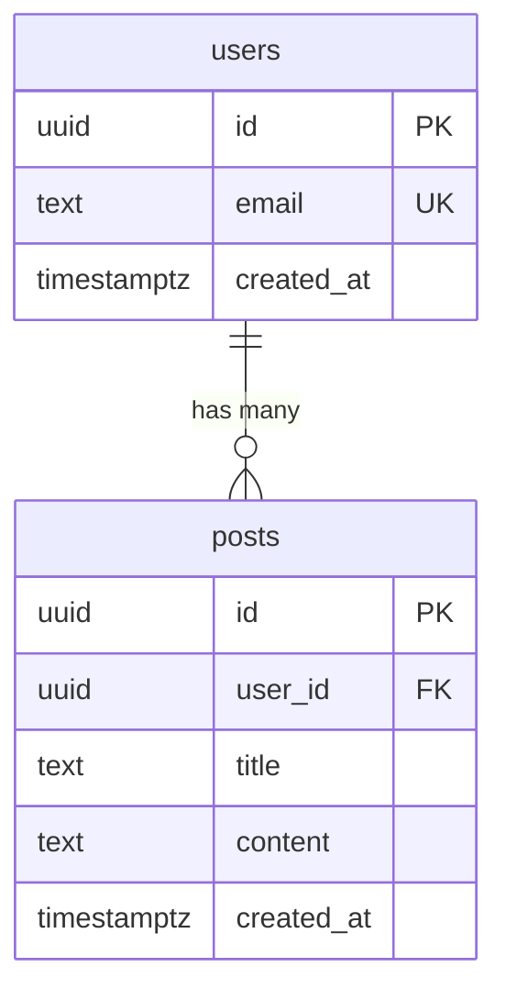

# Codebase Analysis Reference

Detailed reading strategies for each analysis layer. Reverse-spec's SKILL.md defines WHAT
to analyze; this document defines HOW to analyze it efficiently and accurately.

## Table of Contents
1. Schema & Data Model Analysis
2. API Layer Analysis
3. Business Logic Analysis
4. Frontend Structure Analysis
5. Auth & Security Analysis
6. Integration Analysis
7. Infrastructure Analysis
8. Testing Analysis
9. Monorepo-Specific Patterns

---

## 1. Schema & Data Model Analysis

The data model is ground truth. Start here because everything else depends on it.

### Where to Look

| Framework/Tool | Schema Location | Migration Location |
|---|---|---|
| Drizzle ORM | `src/db/schema.ts` or `drizzle/schema.ts` | `drizzle/migrations/` |
| Prisma | `prisma/schema.prisma` | `prisma/migrations/` |
| SQLAlchemy | `models/*.py` or `app/models.py` | `alembic/versions/` |
| Wrangler D1 | `migrations/*.sql` or `schema.sql` | Same location |
| Supabase | `supabase/migrations/` | Same, plus `supabase/seed.sql` |
| Raw SQL | `*.sql` files, `init.sql`, `schema.sql` | Look for numbered files |

### What to Extract

For each table:
- **Name and purpose** (infer from name + columns)
- **Columns**: name, type, constraints (PK, FK, NOT NULL, UNIQUE, DEFAULT)
- **Relationships**: foreign keys → parent table, cardinality (1:1, 1:N, M:N)
- **Indexes**: which columns, type (btree, unique, composite), rationale
- **RLS policies**: if Supabase/Postgres, check for row-level security
- **Timestamps**: created_at, updated_at, deleted_at (soft delete pattern?)
- **Enums/types**: custom types, status fields, role fields

### Migration History

Read migrations in order to understand how the schema evolved. This reveals:
- Tables that were added later (feature additions)
- Columns that were renamed or retyped (design changes)
- Indexes added after initial creation (performance fixes)
- Migrations that are just ALTER TABLE (tech debt patches)

### Output: ER Diagram

Generate a Mermaid erDiagram showing all entities and relationships. Example:



---

## 2. API Layer Analysis

### Where to Look

| Framework | Route Definition | Handler Location |
|---|---|---|
| Hono | `src/index.ts` or `src/routes/*.ts` | Inline or `src/handlers/` |
| Express | `src/routes/*.ts` or `app.use()` calls | Inline or `src/controllers/` |
| FastAPI | `app/main.py` or `app/routers/*.py` | Decorated functions |
| Next.js API | `app/api/**/route.ts` or `pages/api/*.ts` | File-based routing |

### What to Extract Per Endpoint

| Field | How to Find |
|---|---|
| Method + Path | Route decorator/definition |
| Auth requirement | Middleware chain, guard decorators, `requireAuth()` calls |
| Input validation | Zod schema, Pydantic model, Joi schema on request |
| Response shape | Return type, TypeScript generic, response schema |
| Error handling | Try/catch blocks, error middleware, custom error classes |
| Rate limiting | Middleware or decorator presence |

### Endpoint Inventory Table

Produce a table in the 02-architecture.md format:

```markdown
| Method | Path | Description | Auth | Request Shape | Response Shape |
|---|---|---|---|---|---|
| GET | /api/users/:id | Get user by ID | Bearer token | — | `{ user: User }` |
| POST | /api/posts | Create post | Bearer token | `{ title, content }` | `{ post: Post }` |
```

### Middleware Chain

Document the middleware execution order — this reveals cross-cutting concerns:
```
Request → CORS → Rate Limit → Auth → Validation → Handler → Error Handler → Response
```

---

## 3. Business Logic Analysis

### What Counts as Business Logic

Code that transforms data according to domain rules, as opposed to:
- Plumbing (routing, middleware, config) → infrastructure
- Display (components, styles) → frontend
- Persistence (queries, migrations) → data layer

### Where to Look

- `src/services/`, `src/lib/`, `src/utils/`, `src/domain/`
- Any file imported by route handlers that isn't a model or component
- Functions that contain conditional logic based on domain state
- Calculation functions, validation functions, workflow orchestrators

### What to Extract

For each significant business logic module:
- **Purpose**: What domain operation does it perform?
- **Inputs/Outputs**: What goes in, what comes out?
- **Side effects**: Does it write to DB, call external services, send notifications?
- **Complexity hotspots**: Where does the logic get dense? (cyclomatic complexity)
- **Error handling**: What can go wrong and how is it handled?

### Dead Code & Unused Exports

High-signal for gap analysis. Check for:
- **Exported functions never imported** — `grep -r "functionName"` across the codebase
- **Feature flags referencing removed features** — stale conditionals
- **Commented-out code blocks** — often reveal abandoned features or deferred work
- **TODO/FIXME/HACK comments** — document these in the gap analysis, they're the original
  developer's own tech debt acknowledgment

---

## 4. Frontend Structure Analysis

### Component Hierarchy

Map the component tree from route-level pages down to leaf components.

**How to build the tree:**
1. Start with the router (React Router, Next.js file router, etc.)
2. For each route, find the page component
3. For each page, find imported components
4. Recurse until you hit leaf components (no child components)

### Design Token Extraction

Look in these locations for design decisions:

| Token Type | Where to Find |
|---|---|
| Colors | `tailwind.config.js` theme.colors, CSS variables in `:root`, constants file |
| Typography | tailwind.config fontFamily, CSS font-face declarations, Google Fonts import |
| Spacing | tailwind.config theme.spacing, CSS variables for gaps/padding |
| Breakpoints | tailwind.config screens, CSS media queries |
| Shadows/Borders | tailwind.config boxShadow/borderRadius, CSS variables |

### State Management Patterns

Identify which pattern(s) are in use:

| Pattern | Signals |
|---|---|
| React state (useState/useReducer) | `useState`, `useReducer` calls |
| Context API | `createContext`, `useContext`, Provider components |
| Zustand | `create()` stores, `useStore` hooks |
| TanStack Query | `useQuery`, `useMutation`, QueryClient |
| Redux | `createSlice`, `useSelector`, `useDispatch` |
| URL state | `useSearchParams`, `useRouter` |
| Local storage | `localStorage.getItem/setItem`, custom hooks wrapping storage |

---

## 5. Auth & Security Analysis

### Auth Method Detection

| Auth Method | Signals |
|---|---|
| WebAuthn/Passkeys | `navigator.credentials`, `@simplewebauthn/*` imports |
| JWT | `jsonwebtoken` import, `jwt.sign/verify`, Bearer token middleware |
| Session-based | `express-session`, cookie-session, session table in DB |
| OAuth/Social | `passport-*`, Auth0 SDK, Supabase Auth, NextAuth |
| Cloudflare Access | `CF-Access-*` headers, Access policy config |
| API keys | API key validation middleware, keys table in DB |

### Authorization Model Detection

| Model | Signals |
|---|---|
| RBAC | `role` column in users, role checks in middleware (`if role === 'admin'`) |
| ABAC | Attribute-based checks (`if user.department === 'engineering'`) |
| RLS | Postgres policies, `auth.uid()` in queries, Supabase RLS config |
| ACL | Permissions table, user-resource mapping, `canAccess()` functions |

---

## 6. Integration Analysis

### Detection Strategies

1. **Environment variables**: `.env.example` lists all external service connections
2. **Package dependencies**: SDK packages reveal integrations (e.g., `stripe`, `@sendgrid/mail`)
3. **HTTP clients**: `fetch`, `axios`, `got` calls to external URLs
4. **Webhook handlers**: Routes like `/api/webhooks/*` or `/api/hooks/*`

### For Each Integration, Extract:

- Service name and purpose
- Auth method (API key, OAuth, webhook signature)
- SDK or raw HTTP?
- Which code paths trigger it?
- Error handling / fallback behavior
- Rate limit awareness?

---

## 7. Infrastructure Analysis

### Cloudflare-Specific (aidops pattern)

| Artifact | Location | What It Reveals |
|---|---|---|
| `wrangler.toml` | Root | Workers config, D1 bindings, KV namespaces, routes |
| `wrangler.jsonc` | Root | Same as above, JSON format |
| Bindings in toml | `[[d1_databases]]`, `[[kv_namespaces]]` | Which storage backends |
| `pages/` or `dist/` | Build output | Static site or SPA deployment |
| `workers/` | Multi-worker setups | Service worker architecture |

### General Infrastructure

| Artifact | Location | What It Reveals |
|---|---|---|
| `Dockerfile` | Root | Container-based deployment |
| `docker-compose.yml` | Root | Local dev environment, service dependencies |
| `.github/workflows/` | Root | CI/CD pipeline steps |
| `vercel.json` | Root | Vercel deployment config |
| `fly.toml` | Root | Fly.io deployment |
| `netlify.toml` | Root | Netlify deployment |
| `railway.json` | Root | Railway deployment |

---

## 8. Testing Analysis

### Test Infrastructure Detection

| Framework | Signals |
|---|---|
| Vitest | `vitest.config.ts`, `describe/it/expect` with vitest imports |
| Jest | `jest.config.js`, `@jest/globals` imports |
| Pytest | `conftest.py`, `test_*.py` files, `pytest.ini` |
| Playwright | `playwright.config.ts`, `@playwright/test` imports |
| Cypress | `cypress.config.ts`, `cypress/` directory |

### Coverage Assessment

Don't just check if tests exist — check what they actually test:
- **Unit tests**: Do they test business logic or just trivial helpers?
- **Integration tests**: Do they hit the DB or mock everything?
- **E2E tests**: Do they cover the critical user flows or just the happy path?
- **Missing tests**: Which modules have zero test coverage?

---

## 9. Monorepo-Specific Patterns

### Workspace Detection

| Tool | Config File | Package Location |
|---|---|---|
| npm workspaces | `package.json` → `"workspaces"` | As specified in array |
| pnpm | `pnpm-workspace.yaml` | As specified |
| Turborepo | `turbo.json` | Uses npm/pnpm workspaces |
| Nx | `nx.json` + `workspace.json` | `apps/`, `libs/` |
| Lerna | `lerna.json` | `packages/` |

### What to Inventory Per Package

```markdown
| Package | Type | Dependencies | Shared By | Description |
|---|---|---|---|---|
| apps/web | App (frontend) | @repo/ui, @repo/types | — | Main web application |
| apps/api | App (backend) | @repo/db, @repo/types | — | API server |
| packages/ui | Library | react | apps/web | Shared component library |
| packages/types | Library | zod | apps/web, apps/api | Shared type definitions |
```

### Cross-Package Type Sharing

This is critical for oc-stack-forge audit. Check:
- Are types defined once and imported across packages?
- Or are types duplicated (drift risk)?
- Is there a shared types/contracts package?
- Does the build pipeline enforce type consistency?
